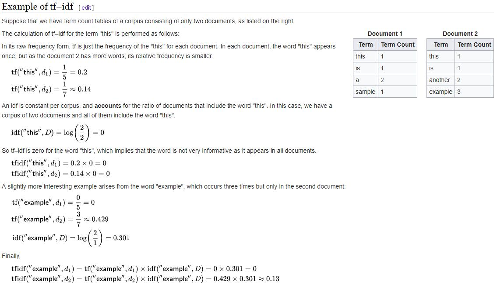

# natural_language_processing

### 1. NLP经常要做的一些工作：

第一步，tokenize分词，把一句长话分成很多很多词，工具：python - nltk包（对英文），jieba（对中文）

第二步，stemming和lemma，把词的各种时态、形式统一统一

a. 词干提取(stemming)：比如把所有walked、walking这种都统一为walk，去掉不影响词形的小尾巴

b. 词形归一(lemmatization): 把每个词的多种时态统一，比如went归为go，are归为be

两者比较：https://www.neilx.com/blog/?p=1425  一般lemmatization基于词典（比如wolves会变为wolf，这样统一后的结果更有实际意义，但比较耗时），而stemming基于简单粗暴地词缩减（比如wolves会变为wolv，没实际意义，也因为这样效率能高些）。

第三步，去除stop words，nltk有stopwords库，去掉the a这种没意义的词

第四步，计算现在的文本中每个term（词）的TF-IDF

TF-IDF, Term Frequency - Inverse Document Frequency, 一个term在文档中出现地有多频繁 - 衡量一个term有多重要（有些term虽然在文档中出现的次数很多比如the a这种，但其实没啥卵用）

TF(t) = term t在文档中的出现次数 / 文档中一共的term总数

为了平衡，我们把罕见词的重要性weights提高、把频繁次的重要性降低

IDF(t) = log(e为底)(文档总数 / 含有term t的文档总数)

hence TF-IDF = TF(t) * IDF(t)

  

第五步，算出来的这些TF-IDF值就是vectors可以输入给计算机用各类model或DL网络学习

### 2. 实例home_depot_product_search_relevance.ipynb和html - Bayer project - 分析药品

Home Depot网站（五金类商品贩卖）有自带的搜索引擎，你只需要在里面输入“我要打地基”、“我要修围墙”之类的短语，网站会自动匹配和返回给你所需的五金商品比如铁铲、砖石等等。本实例的目的是预测product name和对应search term的relevance有多高(1到3个level），具体看.ipynb。未来我网站就知道用户输入某个search term之后、应该给其推荐哪些product

1) 文本预处理, 做stemming和lemma

2) 自制文本特征，针对经过文本预处理后的product title和searched term，经过如下比对后构造出新的文本features：

a. len_of_query: searched_term关键词的长度

b. commons_in_title: searched_term和product_title有多少关键词重合

c. commons_in_desc: searched_term和product_description有多少关键词重合

这一步就是脑洞大开，能出多少新feature就出多少。

3) 用上步新构建的文本features和label(也就是relevance相关系数)构成train_data，用Random Forest跑cross validation，最后就得到model（到这一步的时候跟传统的ML没啥区别了）

### 3. 实例TweetsIsPoliticalOrNot - PoC from IBM - 分析comment评论数据，做分类，主要是like or dislike

Scikit-learn的Count或TF-IDF Vectorizer

有训练集，有测试集，基本格式就是：label(political or NOT) + tweets推文，一共2000多条tweets

我们构建的属于非常初级的bag of words model，就是基于词包的模型。但这种model其实是不准确的，因为它无法考虑到词和词之间的关联性（你可以用更高级点的比如Google训练出的word2vec，每个词都表示成了一个128维的向量，在这个向量中，东京、上海、北京会很近，纽约、华盛顿会很近，因为它参考了地理信息等。维度的话，其实都是一些大自然Natural很常规的信息。所以基于gensim(就是generate similar)的word2vec构建的NLP model就比bag of words model更好。

用Count Vectorizer（相对应的还有TF-IDF Vectorizer）实现bag of words，两者思路上大体一致，区别就是前者是数每个词的文档中的出现次数，后者更高级点，用TF(term)*IDF(term)数每个词的出现次数+重要性（所以出现越频繁越稀有的词[不是the a这种stopwords-停止词]的权值就越大）。

构建出的train data就是1800条（1800条tweets），每一条是9000多列（因为有9000多个词，每个词的位置是其出现在这条tweet中的次数）。因为维数高于train data count了，出现了维度爆炸dimension exploration，所以用Logistic Regression的时候加一个penalty L1 norm构成LASSO Regression（相较于L2 norm的Ridge Regression）会更好，这样有助于我们filter更重要的features。最后accuracy才20%很低啊。

### 4. 从新闻预测股市的变化 Simple版news_stock.html - PoC from IBM - 分析comment评论数据

原数据格式，按日期，一共1900多条，每条有top 25条新闻（这些新闻组成一个大新闻字段直接string join连接起来）。这次我们用TF-IDF来构建train data实现bag of words model。

用scikit-learn的SVM训练，当然你也涉及到先给每条新闻tokenize，然后lemma和stemming，删除stopwords、没用的数字numbers。

然后train data就是1611条（1611个日期、每个日期一行数据）、每条32125个列（每个列-维度其实就是一个词，每个位置是这个词的TF-IDF值）。

具体Count Vectorizer和TF-IDF Vectorizer参见链接：Scikit-learn CountVectorizer与TfidfVectorizer - CSDN  https://blog.csdn.net/the_lastest/article/details/79093407

最后得到AUC是0.6也不太高。

### 5. 从新闻预测股市的变化 Advanced版news_stock_advanced.html - PoC from IBM - 分析comment评论数据

原数据格式，按日期，一共1900多条，每条有top 25条新闻（这些新闻组成一个大新闻字段直接string join连接起来）。这次我们用word2vec来构建train data，每条是一天的数据，然后每条数据的值呢，是对应当天全部top25条新闻内容的前256个单词的平均word2vec值（128维的）。

CSDN - 大白话讲解word2vec到底在做些什么：https://blog.csdn.net/mylove0414/article/details/61616617

所以训练集和测试集分别是两个matrix：

(1611, 256, 128)

(378, 256, 128)

进一步构建成这样一个大大的matrix：

(1611, 1, 256, 128)

(378, 1, 256, 128)

我们要让每一个matrix外部“包裹”一层维度。来告诉我们的CNN model，我们的每个数据点都是独立的。之间木有前后关系。 （其实对于股票这个case，前后关系是存在的。这里不想深究太多这个问题。有兴趣的同学可以谷歌CNN+LSTM这种强大带记忆的深度学习模型。）

然后我们调keras的sequential model（就是从头直接干到尾输出结果这样类型的model），一层一层地添加，添加一个2D Convolution层（卷积层），16个filter window滤波矩阵），每个4*4 length*length，这样16*(4*4)=256正好把256面积全部relu激活函数Activation扫描进来（Relu比Sigmoid的好处是可以避免gradient vanish梯度消失，长时间不convergence）。卷积层后再加一个池化层，MAX POOLING池化层用2*2的方式作抽象abstraction，在Dropout层设0.25即避免overfit扔掉0.25百分点的神经元。loss函数设MSE即mean-squared error。然后train test得到准确率50%，不错！

你很好奇Google或者Gensim怎么训练得到这么好的pkg word2vec的？看这个文章：http://www.sohu.com/a/128794834_211120  其实也是用多层神经网络模型训练的。个人读书时，如果遇到了生僻的词，一般能根据上下文大概猜出生僻词的意思，而 Word2Vec 正是很好的捕捉了这种人类的行为，利用神经元网络模型，发现了自然语言处理的一颗原子弹。